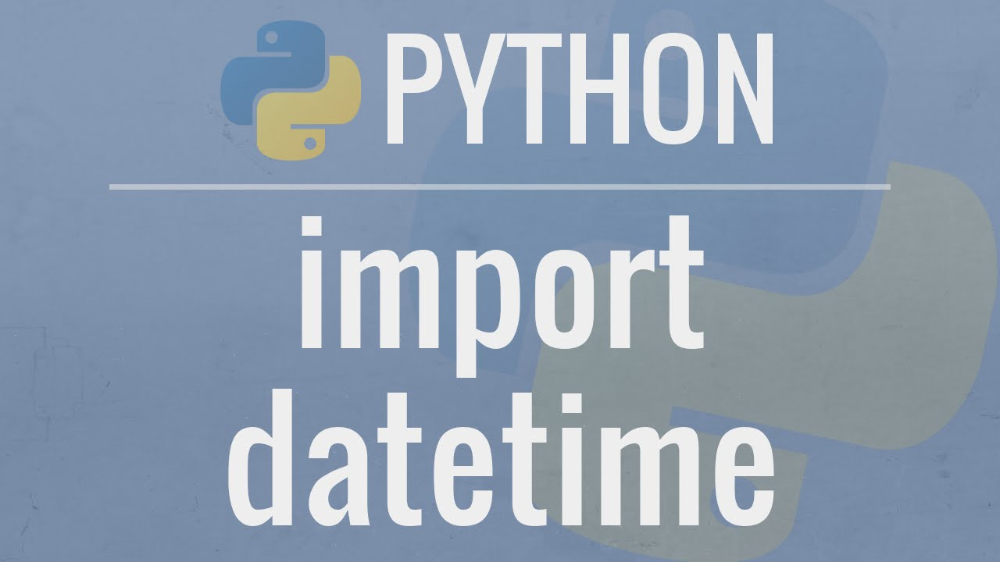

# La librería Datetime

Para manejar fechas en Python se suele utilizar la librería datetime que incorpora los tipos de datos date, time y datetime para representar fechas y funciones para manejarlas. Algunas de las operaciones más habituales que permite son:

- Acceder a los distintos componentes de una fecha (año, mes, día, hora, minutos, segundos y microsegundos).
- Convertir cadenas con formato de fecha en los tipos date, time o datetime.
- Convertir fechas de los tipos date, time o datetime en cadenas formateadas de acuerdo a diferentes formatos de fechas.
- Hacer aritmética de fechas (sumar o restar fechas).
- Comparar fechas.

Recursos: https://aprendeconalf.es/docencia/python/manual/datetime/
